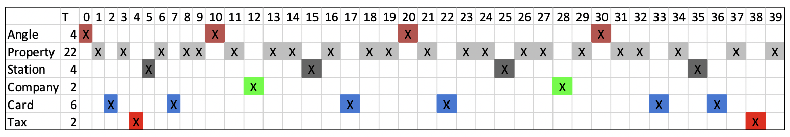
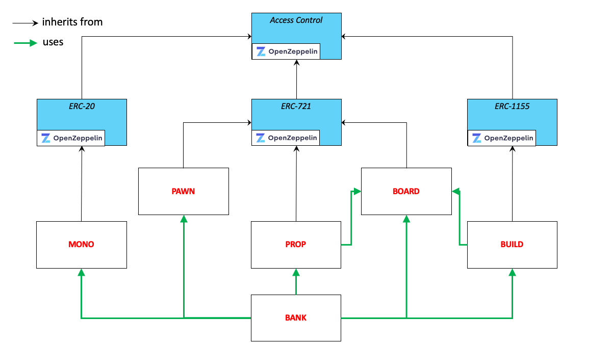

# Design Pattern Decisions

### Board

### Modelization

### List of tokens

- **MONO** (ERC-20): fungible token, native currency for playing and buying PROP and BUILD tokens;
- **PAWN** (ERC-721): to be used by player to play

| Size      | Name       | Description                                                                                     |
| --------- | ---------- | ----------------------------------------------------------------------------------------------- |
| **uint8** | subject    | car, thimble, hat, ship, shoe, wheelbarrow, dog, cat                                            |
| **uint8** | background | blanc, noir, bleu, rouge, vert, jaune, bleu clair, violet, arc-en-ciel                          |
| **uint8** | material   | carton, bois, plastique, cuivre, plomb, étain, argent, palladium, platine, or                   |
| **uint8** | halo       | aucun, bleu électrique, jaune solaire, pure blanc, vert plasma, psycho arc-en-ciel, fusion flou |
| **uint8** | power      | aucun, monopole, anarchiste, politicien, avocat, juge, banquier, médias, startuper, star, CEO   |
| **uint8** | level      |                                                                                                 |
| **uint8** | xp         |                                                                                                 |

- **PROP** (ERC-721): non-fungible token, represents the property of a land, with a unique id generated from

| Size       | Name    | Description                      |
| ---------- | ------- | -------------------------------- |
| **uint16** | edition | version                          |
| **uint8**  | land    | [0, …, 39]                       |
| **uint8**  | rarity  | 0 = unique, 1 = rare, 2 = common |
| **uint32** | serial  | 0 <= serial < 10^rarity          |

- **BUILD** (ERC1155): partially fungible token, represents the property of a build on a land, with id generated from

| Size       | Name    | Description                                     |
| ---------- | ------- | ----------------------------------------------- |
| **uint16** | edition | version                                         |
| **uint8**  | land    | [0, …, 39]                                      |
| **uint16** | type    | type of building (building, house, hotel, etc…) |

### Smart contracts architecture

- **MONO**: native token of MonopolyWorld platform/game;
- **PROP**: NFT owned by player, represents a Monopoly property (estate);
- **BUILD**: token owned by a player, represents a Monopoly build (house, hotel);
- **BOARD**: represents the Monopoly board (land, building land, max rarity level, max build type) for each edition; may contains also playing rules;
- **BANK**: players interact with the Bank to buy PAWN, PROP and BUILD and play;

