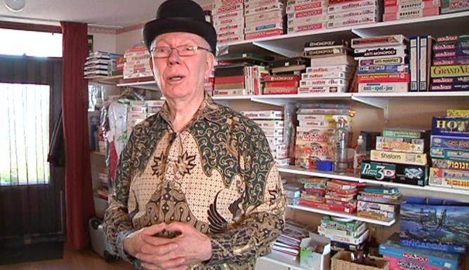

# mnp-trufflebox



MNW smart contracts and React-based Dapp

This is a React Truffle box project: for more information, please check http://trufflesuite.com/boxes/react/index.html

This repository contains all the MNW smart contracts (in /contracts), along with a React.js front-end (in /client).

## Online demo
https://mnp-app.herokuapp.com/

Available for mumbai testnet

Players must have MATIC to pay transactions.

MATIC faucet
https://faucet.polygon.technology/

See [Deployed addresses](DEPLOYED_ADDRESSES.md)

## Security reports
See Slither analysis at [`security` branch](https://github.com/jcaporossi/mnp-trufflebox/tree/feature/security)

## Use of Chainlink VRF oracle for randomness
### ChainLink workflow
1. Receive request  
2. Generating the random and sending crypto proofs to the VRF contract  
3. Verify and send random number to our Board contract  

### Our workflow
1. Send request  
Bank.`rollDices()` -> Board.`play()` -> Board.requestRandomNumber() -> VRFConsumerBase.requestRandomness()  
2. Receive random number  
ChainLink VRF Coordinator call  
Board.rawFulfillRandomness() -> Board.fulfillRandomness() -> Board.gameStrategist()  
#### /!\ ChainLink limit callback function to 200k gas 
Low gas strategy is to record booleans in Board.fulfillRandomness() via gameStrategist()

These flags will be managed in the front.
The necessary checks and calculations will be made in the contract at the time of a transaction made by the player.
That way we don't overload the callback called by Chainlink and we charge the user fees.  

#### Retrieving gas used
search `RandomReady` event for Board contract in mumbai explorer
https://mumbai.polygonscan.com/address/0x8d4d0C5da875f1396c1974C114Eb920871cCd8f0#events
event no is '0x1954c6845304788fb449c20d6a568c6672d0d11585f9d8f32673fba15c9cbf22'
find a transaction related to this event
https://mumbai.polygonscan.com/tx/0x13dfabb80bb5d17d78c667dc7d95076a4c4951ed11fafc4250180d124db8076c  
We find :  
Gas Used by Transaction: 109,418
WELL DONE... is less than 200k 

## Cloning the project

In an empty local directory

```
git clone https://github.com/jcaporossi/mnp-trufflebox.git
```

## Installation

After cloning the project, install dependencies with

```
cd mnp-trufflebox
npm install
cd client
npm install
cd ..
```

## Compilation

To compile all smart contracts:

```
truffle compile
```

## Local node

Start a local node

Open a shell window and launch

```
ganache-cli
```

## Unit Tests

To launch unit tests associated with each smart contracts, in another terminal windows, at root of the project

```
truffle test
```

## Migration

Don't forget, deployer account must have MATIC on Mumbai network

MATIC faucet
https://faucet.polygon.technology/

```
truffle migrate
```

After deployment, give some LINK to Board and Bank contracts.<br/>
LINK faucet https://faucets.chain.link

## Front-end

To launch React front-end

```
cd client
npm start
```

## developer documents
`docs/devdocs/`

## user documents
`docs/userdocs/`