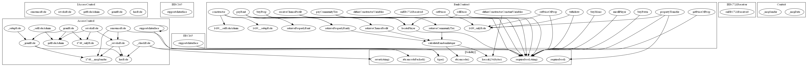
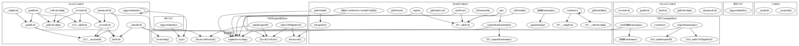
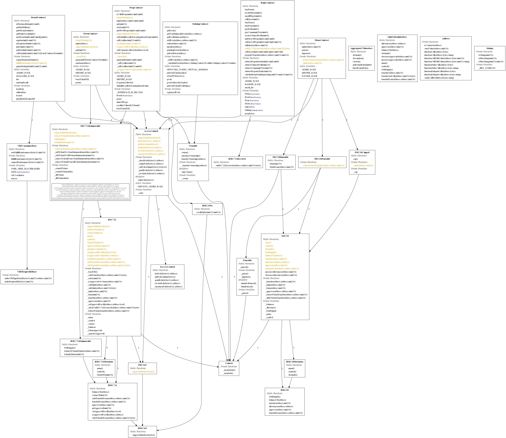
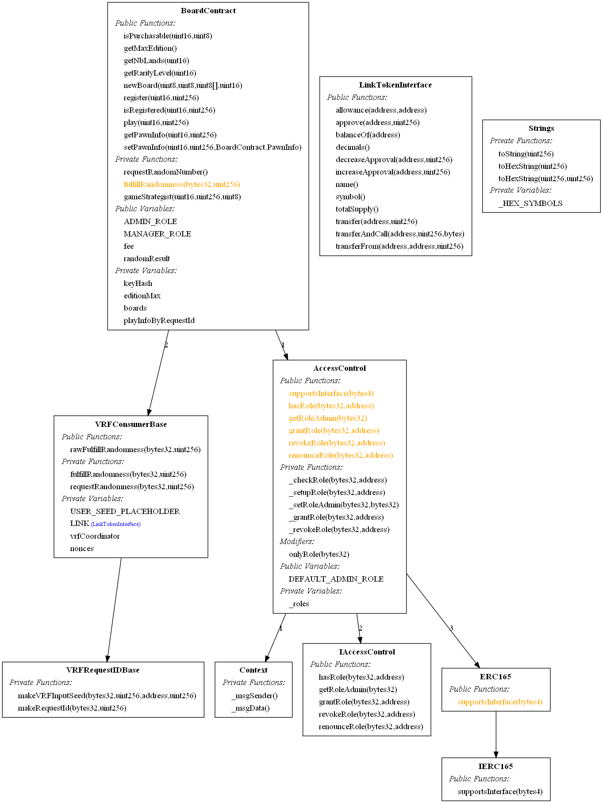

# MNP contracts security
Some security analysis and reports

## with Slither, the Solidity source analyzer
[Slither repo](https://github.com/crytic/slither)

reports are made with solc version 0.8.9 (slither have a bug with 0.8.10)

[Detectors issues documentation](https://github.com/crytic/slither/wiki/Detector-Documentation)

See [brut html report](Security/slither/slither.html)  
See [human summary html report](Security/slither/human-summary.html)

### High issues (critical)
#### [weak PRNG](https://github.com/crytic/slither/wiki/Detector-Documentation#weak-prng)
- PawnContract.mint(address) (share/contracts/Pawn.sol#74-92) uses a weak PRNG: "p.power = 1 + (r % 11) (share/contracts/Pawn.sol#83)"
- PawnContract.mint(address) (share/contracts/Pawn.sol#74-92) uses a weak PRNG: "p.subject = 1 + (r % 8) (share/contracts/Pawn.sol#79)"
- PawnContract.mint(address) (share/contracts/Pawn.sol#74-92) uses a weak PRNG: "p.background = 1 + (r % 10) (share/contracts/Pawn.sol#80)"
- PawnContract.mint(address) (share/contracts/Pawn.sol#74-92) uses a weak PRNG: "p.material = 1 + (r % 10) (share/contracts/Pawn.sol#81)"
- PawnContract.mint(address) (share/contracts/Pawn.sol#74-92) uses a weak PRNG: "p.halo = 1 + (r % 7) (share/contracts/Pawn.sol#82)"
- PawnContract.random(address) (share/contracts/Pawn.sol#128-130) uses a weak PRNG: "uint8(uint256(keccak256(bytes)(abi.encodePacked(block.difficulty,block.timestamp,user))) % type()(uint8).max) (share/contracts/Pawn.sol#129)"

#### [unchecked transfer](https://github.com/crytic/slither/wiki/Detector-Documentation#unchecked-transfer)
- BankContract.rollDices(uint16) (share/contracts/Bank.sol#170-189) ignores return value by Mono.transferFrom(msg.sender,address(this),(chainlinkFee * linkLastPrice) / monoLastPrice + 10 ** 18) (share/contracts/Bank.sol#183)
- BankContract.buyMono() (share/contracts/Bank.sol#192-205) ignores return value by Mono.transfer(msg.sender,amountToBuy) (share/contracts/Bank.sol#202)
- BankContract.propertyTransfer(address,address,uint256,uint256) (share/contracts/Bank.sol#445-469) ignores return value by Mono.transferFrom(_from,receiver,royaltyAmount) (share/contracts/Bank.sol#464)
- StakingContract.stake(address,uint256) (share/contracts/Staking.sol#160-182) ignores return value by pool.info.token.transferFrom(msg.sender,address(this),_amount) (share/contracts/Staking.sol#178)
- StakingContract.unstake(address) (share/contracts/Staking.sol#213-238) ignores return value by pool.info.token.transfer(msg.sender,stakedAmount) (share/contracts/Staking.sol#232)
- StakingContract.unstake(address) (share/contracts/Staking.sol#213-238) ignores return value by rewardToken.transfer(msg.sender,rewards) (share/contracts/Staking.sol#235)

StakingContract._calculateReward(address,StakingContract.PoolInfo,StakingContract.UserInfo) (share/contracts/Staking.sol#192-204) performs a multiplication on the result of a division:
-_user.amount * (block.timestamp - _user.depositDate) * _pool.yield / 100 / 365 / 24 / 60 / 60 * uint256(getLastPrice(address(rewardToken))) / uint256(getLastPrice(_token)) (share/contracts/Staking.sol#199-202)
Reference: https://github.com/crytic/slither/wiki/Detector-Documentation#divide-before-multiply

### Medium issues
#### [Contract locking ether](https://github.com/crytic/slither/wiki/Detector-Documentation#contracts-that-lock-ether)
Contract BankContract (share/contracts/Bank.sol#19-470) has payable functions:
- BankContract.buyMono() (share/contracts/Bank.sol#192-205)
But does not have a function to withdraw the ether

#### [uninitialized local variables](https://github.com/crytic/slither/wiki/Detector-Documentation#uninitialized-local-variables)
- BoardContract.constructor(address,address,bytes32,uint256).n (share/contracts/Board.sol#100) is a local variable never initialized
- PawnContract.mint(address).p (share/contracts/Pawn.sol#77) is a local variable never initialized
- BoardContract.constructor(address,address,bytes32,uint256).landID (share/contracts/Board.sol#98) is a local variable never initialized

#### [unused return](https://github.com/crytic/slither/wiki/Detector-Documentation#unused-return)
- VRFConsumerBase.requestRandomness(bytes32,uint256) (share/node_modules/@chainlink/contracts/src/v0.8/VRFConsumerBase.sol#152-166) ignores return value by LINK.transferAndCall(vrfCoordinator,_fee,abi.encode(_keyHash,USER_SEED_PLACEHOLDER)) (share/node_modules/@chainlink/contracts/src/v0.8/VRFConsumerBase.sol#153)
- ERC721._checkOnERC721Received(address,address,uint256,bytes) (share/node_modules/@openzeppelin/contracts/token/ERC721/ERC721.sol#382-403) ignores return value by IERC721Receiver(to).onERC721Received(_msgSender(),from,tokenId,_data) (share/node_modules/@openzeppelin/contracts/token/ERC721/ERC721.sol#389-399)

### Call graphs
[documentation](https://github.com/crytic/slither/wiki/Printer-documentation#call-graph)

[Bank contract graph](Security/slither/call_graph/Bank.sol.BankContract.call-graph.dot.png)

[Board contract graph](Security/slither/call_graph/Board.sol.BoardContract.call-graph.dot.png)

### Function summary
[documentation](https://github.com/trailofbits/slither/wiki/Printer-documentation#function-summary)
Exemple  
Contract BankContract  
Contract vars: ['_roles', 'DEFAULT_ADMIN_ROLE', 'ADMIN_ROLE', 'BANKER_ROLE', 'Pawn', 'Board', 'Prop', 'Mono', 'Link', 'Staking', 'enroll_fee', 'propPrices']    
Inheritance:: ['IERC721Receiver', 'AccessControl', 'ERC165', 'IERC165', 'IAccessControl', 'Context']  

|                           Function                           | Visibility |          Modifiers           |              Read             |             Write             |                   Internal Calls                   |                                                                 External Calls                                                                 |
|--------------------------------------------------------------|------------|------------------------------|-------------------------------|-------------------------------|----------------------------------------------------|------------------------------------------------------------------------------------------------------------------------------------------------|
|       onERC721Received(address,address,uint256,bytes)        |  external  |              []              |               []              |               []              |                         []                         |                                                                       []                                                                       |
|                  supportsInterface(bytes4)                   |   public   |              []              |               []              |               []              |          ['supportsInterface', 'type()']           |                                                                       []                                                                       |
|                   hasRole(bytes32,address)                   |   public   |              []              |           ['_roles']          |               []              |                         []                         |                                                                       []                                                                       |
|                 _checkRole(bytes32,address)                  |  internal  |              []              |               []              |               []              |         ['hasRole', 'abi.encodePacked()']          |                             ['Strings.toHexString(uint160(account),20)', 'Strings.toHexString(uint256(role),32)']                              |
|                                                              |            |                              |                               |                               |                 ['revert(string)']                 | ['abi.encodePacked(AccessControl: account ,Strings.toHexString(uint160(account),20), is missing role ,Strings.toHexString(uint256(role),32))'] |
|                    getRoleAdmin(bytes32)                     |   public   |              []              |           ['_roles']          |               []              |                         []                         |                                                                       []                                                                       |
|                  grantRole(bytes32,address)                  |   public   | ['getRoleAdmin', 'onlyRole'] |               []              |               []              |            ['getRoleAdmin', 'onlyRole']            |                                                                       []                                                                       |
|                                                              |            |                              |                               |                               |                   ['_grantRole']                   |                                                                                                                                                |
|                 revokeRole(bytes32,address)                  |   public   | ['getRoleAdmin', 'onlyRole'] |               []              |               []              |          ['getRoleAdmin', '_revokeRole']           |                                                                       []                                                                       |
|                                                              |            |                              |                               |                               |                    ['onlyRole']                    |                                                                                                                                                |
|                renounceRole(bytes32,address)                 |   public   |              []              |               []              |               []              |           ['_msgSender', '_revokeRole']            |                                                                       []                                                                       |
|                                                              |            |                              |                               |                               |              ['require(bool,string)']              |                                                                                                                                                |
|                 _setupRole(bytes32,address)                  |  internal  |              []              |               []              |               []              |                   ['_grantRole']                   |                                                                       []                                                                       |
|                _setRoleAdmin(bytes32,bytes32)                |  internal  |              []              |           ['_roles']          |           ['_roles']          |                  ['getRoleAdmin']                  |                                                                       []                                                                       |
|                 _grantRole(bytes32,address)                  |  internal  |              []              |           ['_roles']          |           ['_roles']          |             ['hasRole', '_msgSender']              |                                                                       []                                                                       |
|                 _revokeRole(bytes32,address)                 |  internal  |              []              |           ['_roles']          |           ['_roles']          |             ['hasRole', '_msgSender']              |                                                                       []                                                                       |
|                  supportsInterface(bytes4)                   |   public   |              []              |               []              |               []              |                     ['type()']                     |                                                                       []                                                                       |
|                  supportsInterface(bytes4)                   |  external  |              []              |               []              |               []              |                         []                         |                                                                       []                                                                       |
|                   hasRole(bytes32,address)                   |  external  |              []              |               []              |               []              |                         []                         |                                                                       []                                                                       |
|                    getRoleAdmin(bytes32)                     |  external  |              []              |               []              |               []              |                         []                         |                                                                       []                                                                       |
|                  grantRole(bytes32,address)                  |  external  |              []              |               []              |               []              |                         []                         |                                                                       []                                                                       |
|                 revokeRole(bytes32,address)                  |  external  |              []              |               []              |               []              |                         []                         |                                                                       []                                                                       |
|                renounceRole(bytes32,address)                 |  external  |              []              |               []              |               []              |                         []                         |                                                                       []                                                                       |
|                         _msgSender()                         |  internal  |              []              |         ['msg.sender']        |               []              |                         []                         |                                                                       []                                                                       |
|                          _msgData()                          |  internal  |              []              |          ['msg.data']         |               []              |                         []                         |                                                                       []                                                                       |
| constructor(address,address,address,address,address,address) |   public   |              []              | ['ADMIN_ROLE', 'BANKER_ROLE'] |       ['Board', 'Link']       |          ['_setupRole', '_setRoleAdmin']           |                                                                       []                                                                       |
|                                                              |            |                              |         ['msg.sender']        |        ['Mono', 'Pawn']       |              ['require(bool,string)']              |                                                                                                                                                |
|                                                              |            |                              |                               |      ['Prop', 'Staking']      |                                                    |                                                                                                                                                |
|                          buyPawn()                           |  external  |              []              |        ['Mono', 'Pawn']       |               []              |              ['require(bool,string)']              |                          ['Pawn.mint(msg.sender)', 'Mono.transferFrom(msg.sender,address(this),1000000000000000000)']                          |
|                                                              |            |                              |     ['msg.sender', 'this']    |                               |                                                    |                                                                                                                                                |
|                     locatePlayer(uint16)                     |   public   |              []              |       ['Board', 'Pawn']       |               []              |              ['require(bool,string)']              |                                        ['Board.getMaxEdition()', 'Board.getPawnInfo(_edition,pawnID)']                                         |
|                                                              |            |                              |         ['msg.sender']        |                               |                                                    |                               ['Board.isRegistered(_edition,pawnID)', 'Pawn.tokenOfOwnerByIndex(msg.sender,0)']                                |
|                                                              |            |                              |                               |                               |                                                    |                                                         ['Pawn.balanceOf(msg.sender)']                                                         |
|                     enrollPlayer(uint16)                     |   public   |              []              |       ['Board', 'Mono']       |               []              |              ['require(bool,string)']              |                                    ['Pawn.balanceOf(msg.sender)', 'Pawn.tokenOfOwnerByIndex(msg.sender,0)']                                    |
|                                                              |            |                              |     ['Pawn', 'enroll_fee']    |                               |                                                    |                                ['Board.register(_edition,pawnID)', 'Mono.allowance(msg.sender,address(this))']                                 |
|                                                              |            |                              |     ['msg.sender', 'this']    |                               |                                                    |                                                                                                                                                |
|                      rollDices(uint16)                       |  external  |              []              |       ['Board', 'Link']       |               []              |      ['locatePlayer', 'require(bool,string)']      |    ['Mono.transferFrom(msg.sender,address(this),(chainlinkFee * linkLastPrice) / monoLastPrice + 10 ** 18)', 'Pawn.balanceOf(msg.sender)']     |
|                                                              |            |                              |        ['Mono', 'Pawn']       |                               |                                                    |                                       ['Link.balanceOf(address(Board))', 'Board.play(_edition,pawnID)']                                        |
|                                                              |            |                              |   ['Staking', 'msg.sender']   |                               |                                                    |                                 ['Staking.getLastPrice(address(Mono))', 'Staking.getLastPrice(address(Link))']                                 |
|                                                              |            |                              |            ['this']           |                               |                                                    |                                             ['Board.fee()', 'Board.isRegistered(_edition,pawnID)']                                             |
|                                                              |            |                              |                               |                               |                                                    |                                                   ['Pawn.tokenOfOwnerByIndex(msg.sender,0)']                                                   |
|                          buyMono()                           |   public   |              []              |      ['Mono', 'Staking']      |               []              |              ['require(bool,string)']              |                              ['Mono.transfer(msg.sender,amountToBuy)', 'Staking.NETWORK_TOKEN_VIRTUAL_ADDRESS()']                              |
|                                                              |            |                              |  ['msg.sender', 'msg.value']  |                               |                                                    |                                    ['Mono.balanceOf(address(this))', 'Staking.getLastPrice(address(Mono))']                                    |
|                                                              |            |                              |            ['this']           |                               |                                                    |                                                       ['Staking.getLastPrice(_address)']                                                       |
|                       buyProp(uint16)                        |   public   |              []              |       ['Board', 'Mono']       |               []              |     ['locatePlayer', 'retrievePropertyRarity']     |                           ['Prop.isValidProp(_edition,p.position,_rarity)', 'Board.setPawnInfo(_edition,_pawnID,p)']                           |
|                                                              |            |                              |        ['Pawn', 'Prop']       |                               |              ['require(bool,string)']              |                        ['Prop.mint(msg.sender,_edition,p.position,_rarity)', 'Pawn.tokenOfOwnerByIndex(msg.sender,0)']                         |
|                                                              |            |                              |  ['propPrices', 'msg.sender'] |                               |                                                    |                                             ['Mono.transferFrom(msg.sender,address(this),price)']                                              |
|                                                              |            |                              |            ['this']           |                               |                                                    |                                                                                                                                                |
|                       payRent(uint16)                        |   public   |              []              |       ['Board', 'Mono']       |               []              |      ['retrievePropertyRent', 'locatePlayer']      |                        ['Mono.transferFrom(msg.sender,address(this),amount)', 'Board.setPawnInfo(_edition,_pawnID,p)']                         |
|                                                              |            |                              |        ['Pawn', 'Prop']       |                               | ['retrievePropertyRarity', 'require(bool,string)'] |                          ['Prop.isValidProp(_edition,p.position,_rarity)', 'Pawn.tokenOfOwnerByIndex(msg.sender,0)']                           |
|                                                              |            |                              |     ['msg.sender', 'this']    |                               |                                                    |                                                                                                                                                |
|                   payCommunityTax(uint16)                    |   public   |              []              |       ['Board', 'Mono']       |               []              |      ['retrieveCommunityTax', 'locatePlayer']      |                              ['Board.setPawnInfo(_edition,_pawnID,p)', 'Pawn.tokenOfOwnerByIndex(msg.sender,0)']                               |
|                                                              |            |                              |     ['Pawn', 'msg.sender']    |                               |              ['require(bool,string)']              |                                             ['Mono.transferFrom(msg.sender,address(this),amount)']                                             |
|                                                              |            |                              |            ['this']           |                               |                                                    |                                                                                                                                                |
|                 receiveChanceProfit(uint16)                  |   public   |              []              |       ['Board', 'Mono']       |               []              |      ['retrieveChanceProfit', 'locatePlayer']      |                                 ['Board.setPawnInfo(_edition,_pawnID,p)', 'Mono.transfer(msg.sender,amount)']                                  |
|                                                              |            |                              |     ['Pawn', 'msg.sender']    |                               |              ['require(bool,string)']              |                                                   ['Pawn.tokenOfOwnerByIndex(msg.sender,0)']                                                   |
|           retrievePropertyRent(uint16,uint8,uint8)           |  internal  |              []              |         ['propPrices']        |               []              |                         []                         |                                                                       []                                                                       |
|                retrieveChanceProfit(uint256)                 |  internal  |              []              |               []              |               []              |             ['calculateRandomInteger']             |                                                                       []                                                                       |
|                retrieveCommunityTax(uint256)                 |  internal  |              []              |               []              |               []              |             ['calculateRandomInteger']             |                                                                       []                                                                       |
|               retrievePropertyRarity(uint256)                |  internal  |              []              |               []              |               []              |             ['calculateRandomInteger']             |                                                                       []                                                                       |
|    calculateRandomInteger(string,uint256,uint256,uint256)    |  internal  |              []              |               []              |               []              |        ['abi.encode()', 'keccak256(bytes)']        |                                                        ['abi.encode(randomness,_type)']                                                        |
|              getPriceOfProp(uint16,uint8,uint8)              |  external  |              []              |     ['Prop', 'propPrices']    |               []              |              ['require(bool,string)']              |                                                  ['Prop.isValidProp(_edition,_land,_rarity)']                                                  |
|          setPriceOfProp(uint16,uint8,uint8,uint256)          |   public   |         ['onlyRole']         |    ['BANKER_ROLE', 'Prop']    |         ['propPrices']        |        ['onlyRole', 'require(bool,string)']        |                                                  ['Prop.isValidProp(_edition,_land,_rarity)']                                                  |
|                  withdraw(address,uint256)                   |  external  |         ['onlyRole']         |    ['BANKER_ROLE', 'Mono']    |               []              |        ['onlyRole', 'require(bool,string)']        |                                                         ['Mono.transfer(_to,_value)']                                                          |
|       onERC721Received(address,address,uint256,bytes)        |  external  |              []              |            ['this']           |               []              |                         []                         |                                                                       []                                                                       |
|        setPrices(uint16,uint8,uint8,uint16,uint256[])        |  external  |         ['onlyRole']         |         ['ADMIN_ROLE']        |         ['propPrices']        |                    ['onlyRole']                    |                                                                       []                                                                       |
|      propertyTransfer(address,address,uint256,uint256)       |  external  |         ['onlyRole']         |    ['BANKER_ROLE', 'Mono']    |               []              |           ['require(bool)', 'onlyRole']            |                          ['Prop.safeTransferFrom(_from,_to,_tokenId)', 'Prop.isApprovedForAll(_from,address(this))']                           |
|                                                              |            |                              |        ['Prop', 'this']       |                               |              ['require(bool,string)']              |                                   ['Mono.transferFrom(_from,receiver,royaltyAmount)', 'Mono.balanceOf(_to)']                                   |
|                                                              |            |                              |                               |                               |                                                    |                              ['Prop.royaltyInfo(_tokenId,_salePrice)', 'Mono.transferFrom(_to,_from,_salePrice)']                              |
|                                                              |            |                              |                               |                               |                                                    |                                                           ['Prop.ownerOf(_tokenId)']                                                           |
|                slitherConstructorVariables()                 |  internal  |              []              |               []              |         ['enroll_fee']        |                         []                         |                                                                       []                                                                       |
|            slitherConstructorConstantVariables()             |  internal  |              []              |               []              | ['ADMIN_ROLE', 'BANKER_ROLE'] |                ['keccak256(bytes)']                |                                                                       []                                                                       |
|                                                              |            |                              |                               |     ['DEFAULT_ADMIN_ROLE']    |                                                    |                                                                                                                                                |
|--------------------------------------------------------------|------------|------------------------------|-------------------------------|-------------------------------|----------------------------------------------------|------------------------------------------------------------------------------------------------------------------------------------------------|

|     Modifiers     | Visibility | Read | Write |        Internal Calls        | External Calls |
|-------------------|------------|------|-------|------------------------------|----------------|
| onlyRole(bytes32) |  internal  |  []  |   []  | ['_msgSender', '_checkRole'] |       []       |
|-------------------|------------|------|-------|------------------------------|----------------|

### Inheritance graphs
[documentation](https://github.com/crytic/slither/wiki/Printer-documentation#inheritance-graph)

Examples
Bank contract

Board contract  

